# Risk Survey Challenge

Use your camera to discover safety technology in the real world!

## About

The **Risk Survey Challenge** is a digital scavenger hunt where players use their phone camera to discover safety technology in the real world. When players discover an item, they can use the capture button to add it to their collection log. Discover all 12 types of safety technology to finish the collection log and complete the challenge!

The goal for this experience is to incentivize people explore their homes and workplaces and learn more about the safety technology all around us.

## Install

This app is available as a Progressive Web App (PWA). Add to Home Screen for the best experience!

### https://samela.io/risk-survey-challenge

### Apple

1. Open link in Safari.
2. Go to Share > Add to Home Screen > Add. Select "Open As Web App".

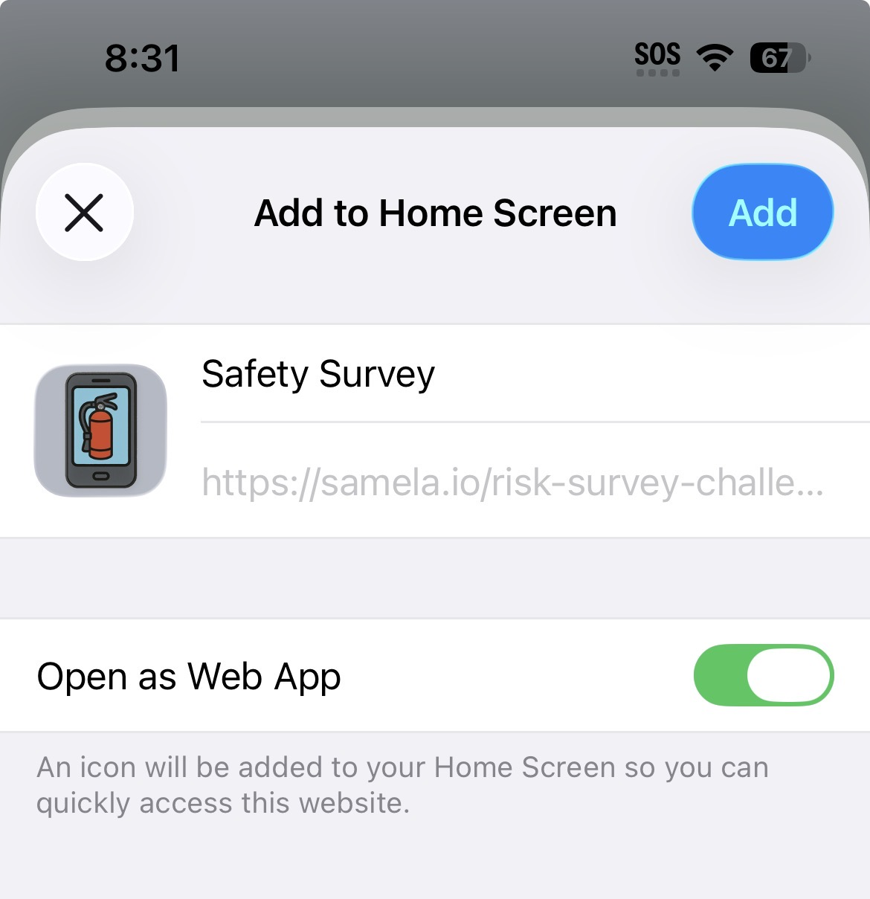

### Android

1. Open link in Chrome.
2. Go to ... > Add to Home screen > Install.

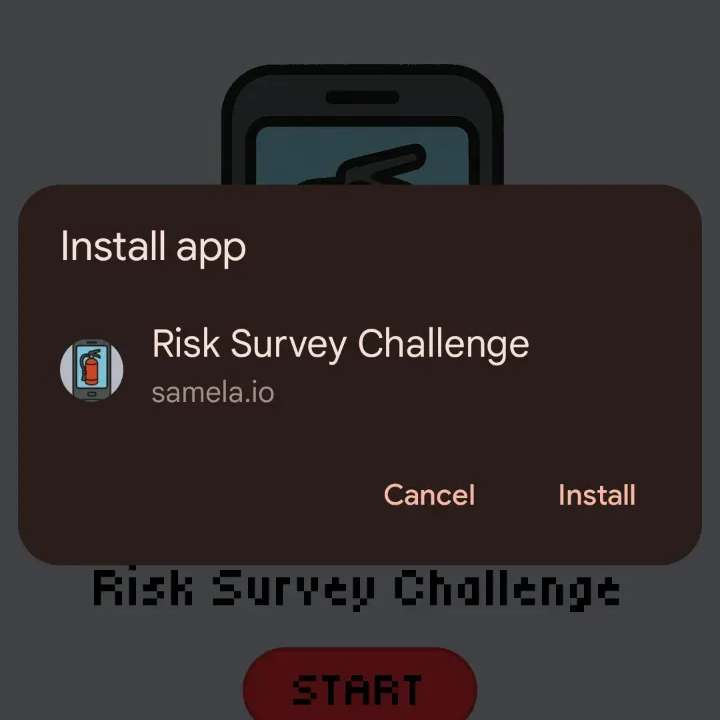

## Collection Log

In the app, swipe down to access the *Collection Log*. Discover an item with your camera and use the capture button to add it to your collection log. Discover all 12 types of safety technology to complete the collection log!

> [!NOTE]
> The computer vision object recognition model was trained specifically for this app. The model runs in browser using [tensorflow.js](https://www.tensorflow.org/js). The model has been trained to identify 12 safety-related items. Images of the exact items pictured below were used as training data. This means, the model may not correctly recognize other versions of these items that are visually different.

| #  | Item              | Example                                              |
|----|-------------------|------------------------------------------------------|
| 1  | Ear Muffs         | 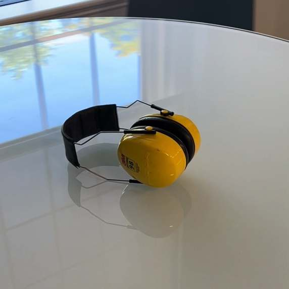         |
| 2  | Emergency Lights  | 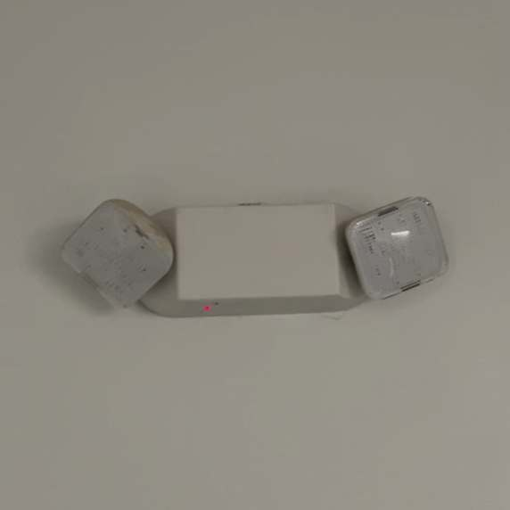  |
| 3  | Exit Sign         | 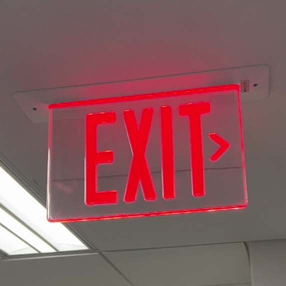         |
| 4  | Fire Alarm        | 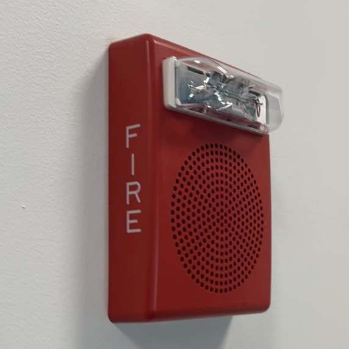        |
| 5  | Fire Extinguisher | 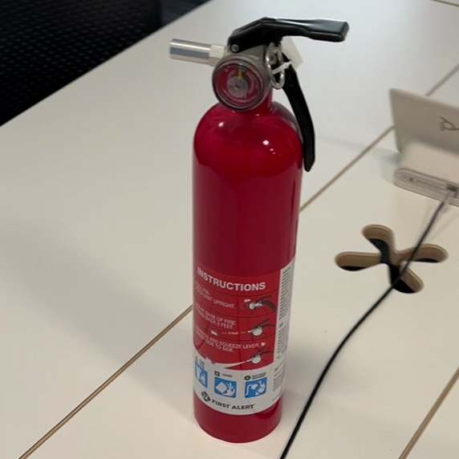 |
| 6  | Goggles           | 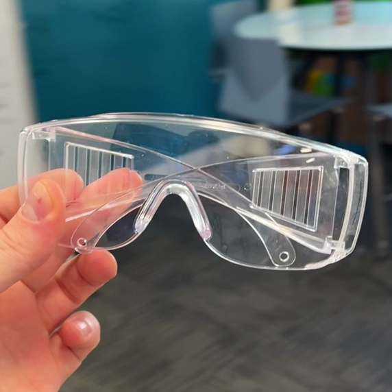           |
| 7  | Life Jacket       | 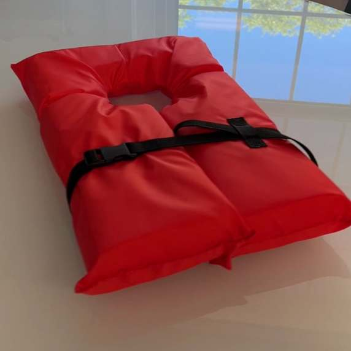       |
| 8  | Respirator        | 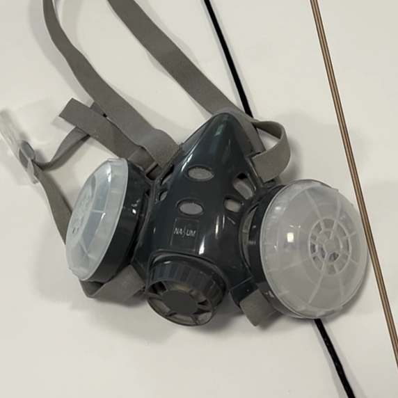        |
| 9  | Traffic Cone      | 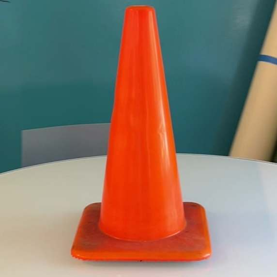      |
| 10 | Water Sensor      | 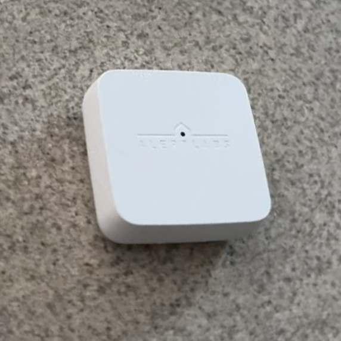      |
| 11 | Work Boots        | 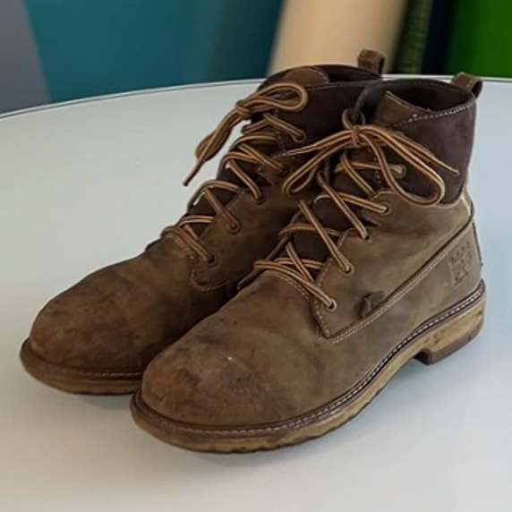        |
| 12 | Work Gloves       | 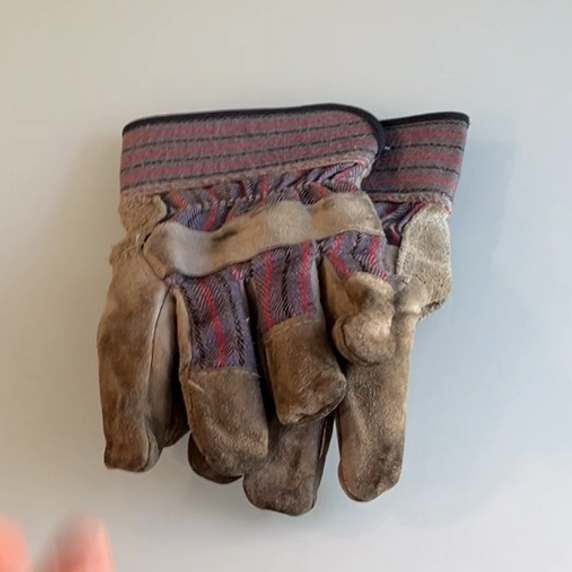       |

## Screenshots

